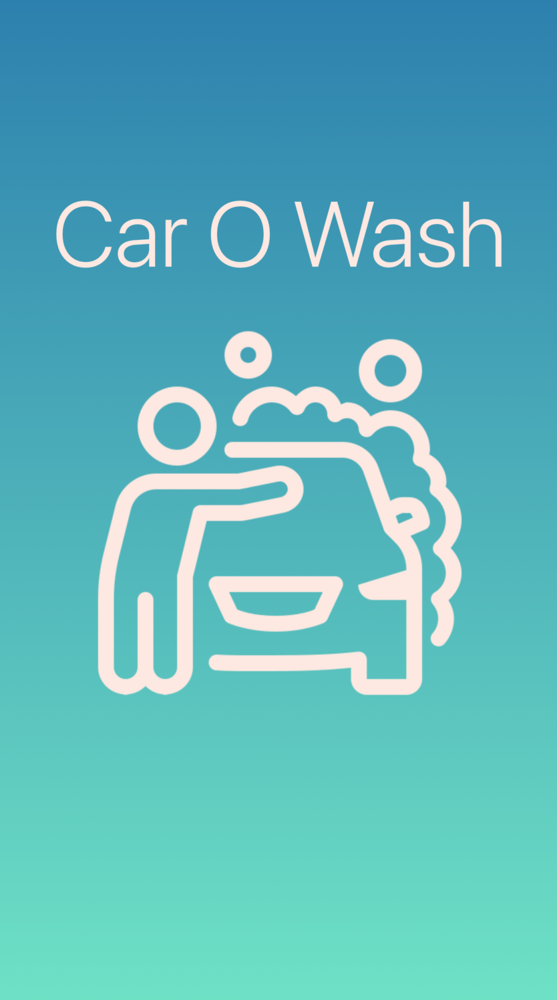
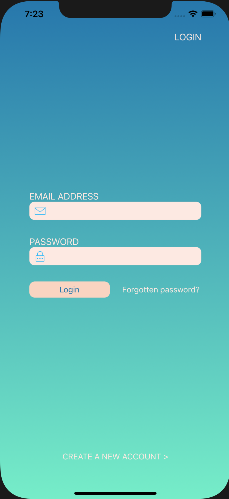
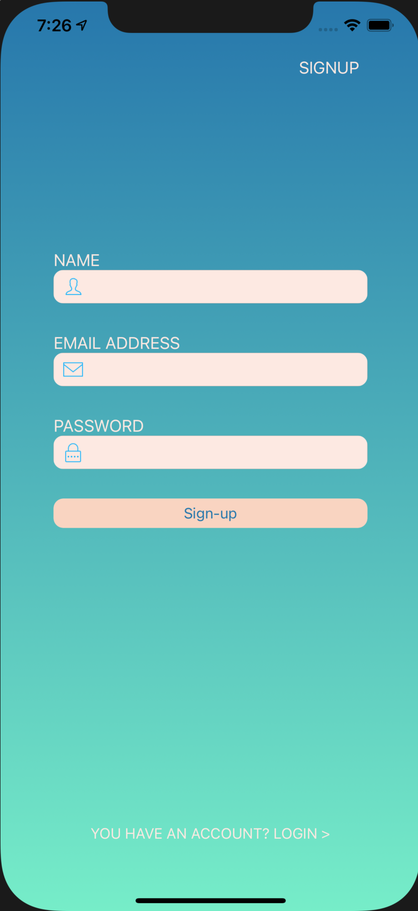
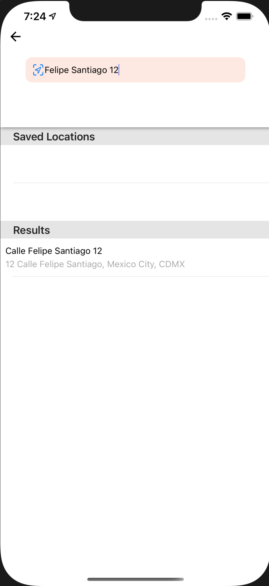
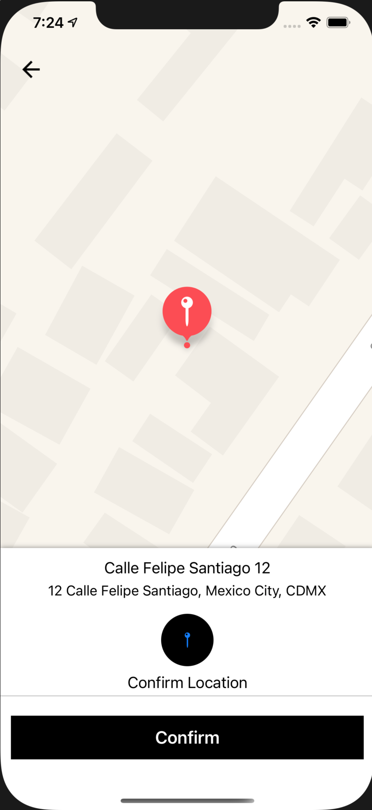
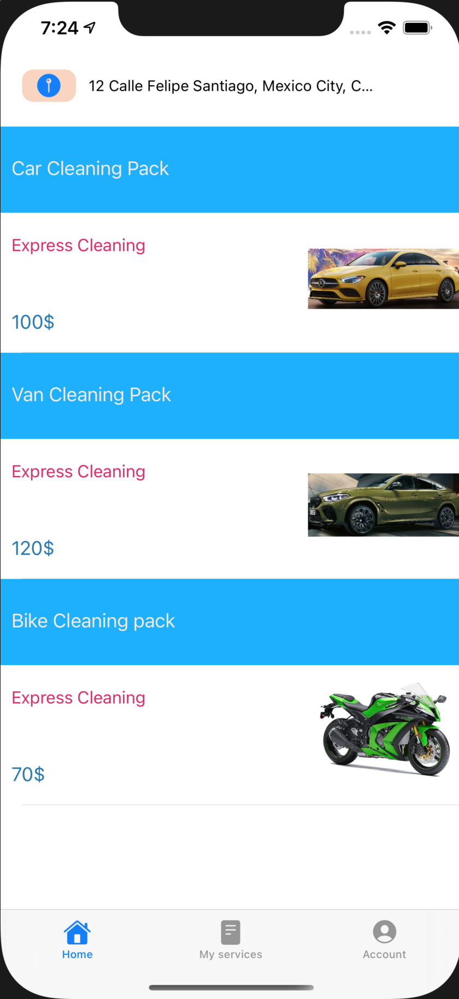
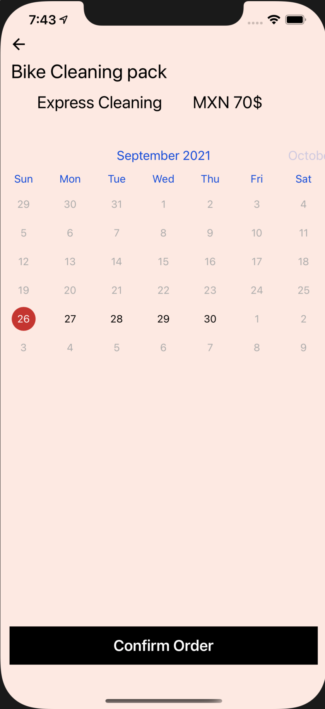
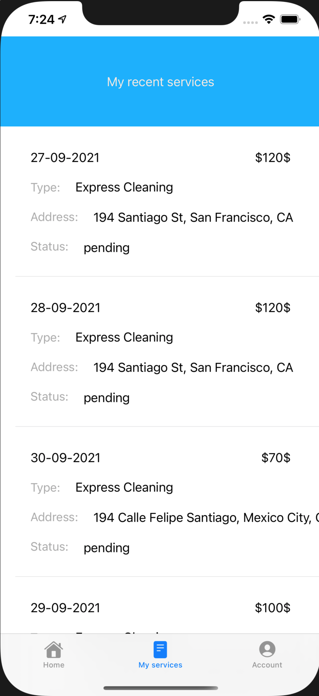
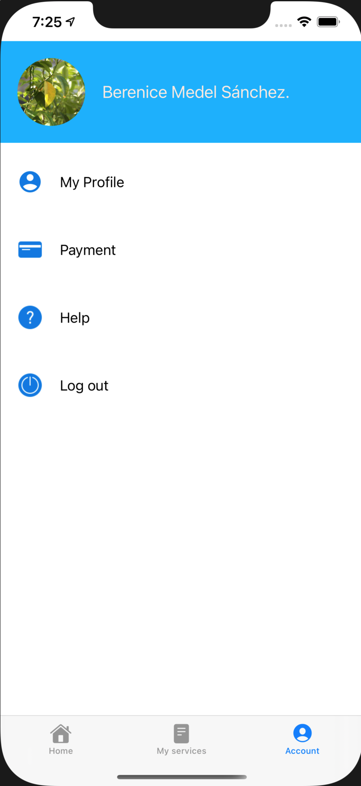
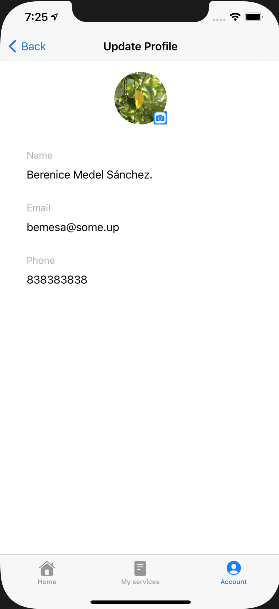

# carowashDocs
Carowash es una aplicación mediante la cual ofrecemos paquetes de lavado de auto a domicilio.

Carowash cuenta con un sistema de autenticación de tipo email/contraseña

 

Carowash te permite elegir y guardar tus ubicaciones favoritas

 

Puedes elegir el paquete que más te convenga y agendar tu cita

 

Puedes ver el historial de tus lavados de auto

 

Puedes modificar ajustes de tu cuenta

 

Aquí un video
[Carowash en funcionamiento]({assets/video.mov} "To carowash video")
